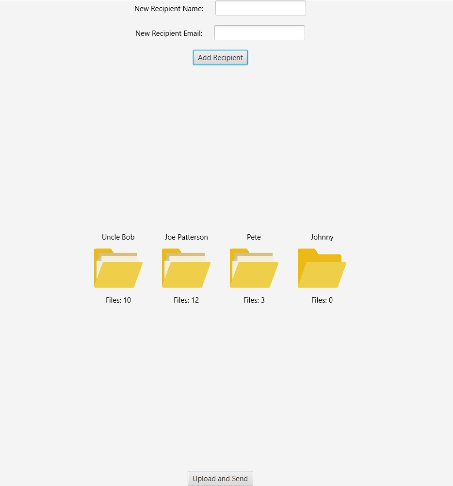

# PhotoSender
An application I wrote in Java to deliver photos using the Google Drive API and Gmail API

I wrote a simple and straightforward GUI using JavaFX. Here's a screenshot:

It's pretty basic since I only made this application for personal use. 
First, a recipient folder is created using a name and an email, and the "Add Recipient" button.
Then, the GUI allows me to drag and drop photos onto the folder of the recipient I want them to be delivered to.
Lastly, after all the appropriate folders have been created and populated, I press the "Upload and Send" button.

The "Upload and Send" button will create the necessary folders on my Google Drive (or whosever Drive that logs in), upload the photos to their respective folders, and then sends emails to each recipient containing their folder's sharing link.

Finally my friends can receive their photos in a timely manner, and I can deliver them hassle free.

Folder icons made by Smashicons from www.flaticon.com

Disclaimer:
My own email and credentials.json have been removed from the public repository code.

